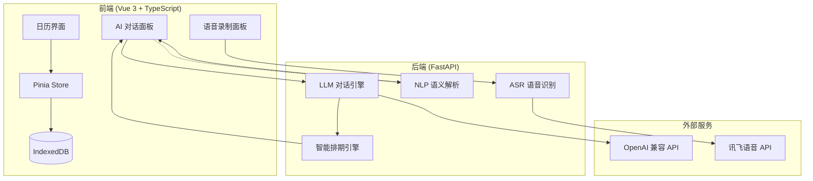

# TalkCalendar

百度网盘视频链接
通过网盘分享的文件：meeting_quick_record.mp4
链接: https://pan.baidu.com/s/1P3Efp3Q1SZRootIBR5XqIA?pwd=fd82 提取码: fd82

TalkCalendar 是一款融合大语言模型与语音识别技术的智能日程管理应用。用户可通过自然语言文本或语音输入完成事件的增删查改，无需手动填写表单。系统内置 NLP 语义解析引擎与规则匹配器，在保障响应速度的同时提供智能化的排期建议。

---

## 核心特性

### 日历交互
- **月视图 / 周视图** — 双视图自由切换，月视图概览全局，周视图按小时精确展示每日时间线
- **点击创建** — 在日历网格或时间槽上直接点击即可快速创建事件
- **侧边小日历** — MiniCalendar 支持月份跳转，有事件的日期以圆点标记

### 智能对话
- **自然语言解析** — 支持 `"明天下午三点和产品开会"` 等自然语言输入，自动提取标题、日期、时间
- **LLM 对话引擎** — 基于 OpenAI 兼容 API 的多轮对话，支持 Function Calling 实现结构化操作
- **规则引擎快速路径** — 查询 / 删除类指令由本地规则引擎即时响应，降低延迟，不依赖 LLM
- **空闲时段查找** — `"本周找个 2 小时深度工作时间"` 自动扫描日历、智能评分、推荐最优时段

### 语音输入
- **讯飞 ASR 集成** — 接入讯飞语音听写 API，支持实时录音、声波可视化、识别结果确认
- **Mock 降级模式** — 未配置讯飞密钥时自动切换本地模拟模式，不影响核心流程演示

### 事件管理
- **冲突检测** — 新建事件自动与已有事件比对，检测时间重叠并阻止保存
- **周期性事件** — 自动识别 `"每周一早九点站会"` 等重复规则，基于 RFC 5545 RRULE 标准
- **表格展示** — 查询日程以结构化表格形式清晰列出时间、标题信息
- **浏览器桌面通知** — 事件开始前 5 分钟弹出系统通知，点击可跳转至对应日期
- **本地持久化** — 基于 IndexedDB 的浏览器本地存储，数据离线可用，刷新不丢失

---

## 系统架构



---

## 技术栈

| 层级 | 技术选型 | 说明 |
|------|----------|------|
| 前端框架 | Vue 3 (Composition API) | 响应式 UI，`<script setup>` 语法 |
| 语言 | TypeScript | 类型安全，完整的类型定义 |
| 状态管理 | Pinia | Vue 3 官方推荐的状态管理方案 |
| 日期处理 | dayjs | 轻量级日期库，支持 ISO Week 插件 |
| 存储 | IndexedDB | 浏览器本地持久化，无需后端数据库 |
| 后端框架 | Python FastAPI | 高性能异步 Web 框架 |
| LLM 集成 | OpenAI SDK (Async) | 兼容 Moonshot/Kimi 等 OpenAI 协议 API |
| 语音识别 | 讯飞语音听写 API | 实时语音转文字 |
| 事件标准 | RFC 5545 RRULE | 周期性事件遵循 iCalendar 标准 |

---

## 快速开始

### 环境要求

- **Node.js** ≥ 18.x
- **Python** ≥ 3.10
- **包管理器** npm / pnpm（前端）

### 1. 克隆项目

```bash
git clone <repo-url>
cd TalkCalendar
```

### 2. 启动后端

```bash
cd backend
pip install -r requirements.txt
python -m uvicorn main:app --reload --port 8000
```

后端默认运行在 `http://localhost:8000`，访问 `/api/health` 验证健康状态。

### 3. 启动前端

```bash
cd frontend
npm install
npm run dev
```

前端默认运行在 `http://localhost:5173`，通过 Vite 代理转发 `/api` 请求至后端。

---

## 配置指南

### LLM 对话引擎

在 `backend/.env` 中配置 OpenAI 兼容 API：

```env
LLM_API_KEY=sk-your-api-key
LLM_BASE_URL=https://api.moonshot.cn/v1
LLM_MODEL=kimi-k2.5
```

| 变量 | 必填 | 说明 |
|------|------|------|
| `LLM_API_KEY` | 否 | API 密钥，不填则使用本地 Mock 模式 |
| `LLM_BASE_URL` | 否 | API 地址，默认 Moonshot |
| `LLM_MODEL` | 否 | 模型名称，默认 `kimi-k2.5` |

### 讯飞语音识别

设置以下环境变量启用真实语音识别：

```bash
export IFLYTEK_APP_ID="your-app-id"
export IFLYTEK_API_KEY="your-api-key"
export IFLYTEK_API_SECRET="your-api-secret"
```

不配置时自动降级为本地 Mock 模式，录音功能可用但识别结果由随机模拟生成。

---

## API 文档

### 对话接口

**`POST /api/dialogue/message`**

请求体：
```json
{
  "text": "明天下午三点和产品开会",
  "session_id": "optional-session-id",
  "events": []
}
```

响应：
```json
{
  "session_id": "abc123",
  "reply": "已为你创建明天15:00的「和产品开会」",
  "action": {
    "tool": "create_event",
    "arguments": { "title": "和产品开会", "date": "2026-06-01", "start_time": "15:00", "end_time": "16:00" }
  }
}
```

**`POST /api/dialogue/reset`** — 重置会话上下文

### NLP 解析接口

**`POST /api/nlp/parse`**

请求体：`{ "text": "明天下午三点和产品开会" }`

响应：
```json
{
  "intent": "add",
  "title": "和产品开会",
  "date": "2026-06-01",
  "time": "15:00",
  "startTime": "2026-06-01T15:00:00",
  "endTime": "2026-06-01T16:00:00"
}
```

### 排期接口

**`POST /api/schedule/find-slots`**

请求体：
```json
{
  "events": [],
  "date_start": "2026-06-01",
  "date_end": "2026-06-07",
  "duration_minutes": 120,
  "prefer_morning": true
}
```

### 语音识别接口

**`POST /api/asr/recognize`** — 上传 WAV 音频文件，返回识别文本

---

## 语音操作示例

| 输入 | 意图 | 效果 |
|------|------|------|
| `明天下午三点和产品开会` | 创建 | 创建明天 15:00–16:00 的事件 |
| `今天有什么安排` | 查询 | 表格展示今日所有事件 |
| `取消明天的会议` | 删除 | 模糊匹配并确认删除 |
| `每周一早九点站会` | 创建（周期） | 创建每周一 09:00 的重复事件 |
| `下周一上午十点站会` | 创建 | 创建下下周一的站会 |
| `周三有什么事` | 查询 | 查询周三安排 |
| `本周找个 2 小时深度工作时间` | 排期 | 查找本周空闲时段并智能排序 |

---

## 项目结构

```
TalkCalendar/
├── frontend/                    # Vue 3 单页应用
│   ├── src/
│   │   ├── components/          # UI 组件
│   │   │   ├── CalendarGrid.vue      # 月视图日历网格
│   │   │   ├── WeekView.vue          # 周视图时间线
│   │   │   ├── EventModal.vue        # 事件创建 / 编辑弹窗
│   │   │   ├── ChatPanel.vue         # AI 对话面板
│   │   │   ├── VoicePanel.vue        # 语音录制面板
│   │   │   ├── SlotPicker.vue        # 空闲时段推荐器
│   │   │   └── MiniCalendar.vue      # 侧边栏小日历
│   │   ├── composables/         # 组合式函数
│   │   │   ├── useVoiceRecorder.ts    # 录音控制
│   │   │   ├── useVoiceAssistant.ts   # 语音助手逻辑
│   │   │   └── useNotifications.ts    # 浏览器通知
│   │   ├── stores/              # Pinia 状态管理
│   │   │   └── calendar.ts           # 日历事件 CRUD + 导航
│   │   ├── types/               # TypeScript 类型定义
│   │   │   └── event.ts              # CalendarEvent 等接口
│   │   └── utils/               # 工具函数
│   │       ├── calendar.ts           # 日期计算、事件匹配、冲突检测
│   │       └── db.ts                 # IndexedDB 封装
│   └── package.json
├── backend/                     # FastAPI 后端
│   ├── main.py                  # 应用入口 + CORS 配置
│   ├── routers/                 # 路由层
│   │   ├── asr.py                    # 语音识别路由
│   │   ├── nlp.py                    # NLP 解析路由
│   │   ├── dialogue.py               # 对话引擎路由
│   │   └── scheduler.py              # 排期引擎路由
│   ├── services/                # 业务逻辑层
│   │   ├── iflytek.py               # 讯飞 SDK 封装
│   │   ├── parser.py                # 中文自然语言解析器
│   │   ├── dialogue.py              # LLM 对话 + Function Calling + Session
│   │   └── scheduler.py             # 智能排期 + 精力曲线评分
│   └── requirements.txt
└── README.md
```

---

## 设计说明

### NLP 解析引擎

内置中文规则解析器 `parser.py`，支持以下语义模式：

- **日期**: 今天 / 明天 / 后天 / 周几 / 下周几 / 具体日期（M月D日）
- **时间**: 上午 / 下午 / 晚上 N 点 / N 点半 / HH:MM 格式
- **意图分类**: 自动识别 添加 / 删除 / 查询 三类操作意图
- **重复规则**: 每天 / 每周 X / 每月 N 号 → RFC 5545 RRULE
- **标题提取**: 从原始文本中剥离时间日期关键词，提取事件标题

### 排期评分算法

`find_free_slots` 基于 6 个维度对空闲时段综合评分（0–100）：

1. **上午偏好** — 08:00–10:00 高分，10:00–12:00 次之
2. **午后惩罚** — 12:00–14:00 扣分
3. **晚间惩罚** — 18:00 以后扣分
4. **工作日加成** — 周一至周五加分
5. **时长匹配** — 需求时长与空闲时长比值越接近 1 越好
6. **碎片避免** — 剩余不足 30 分钟的碎片时段扣分

### 降级策略

系统在外部服务不可用时自动降级，保证核心流程可用：

| 组件 | 正常模式 | 降级模式 |
|------|----------|----------|
| LLM 对话 | Kimi API (Function Calling) | 本地规则 Mock 模式 |
| 语音识别 | 讯飞实时 ASR | 随机模拟文本 |
| 规则引擎 | 快速路径 + LLM 兜底 | 纯规则引擎 |

---

## License

MIT
